# 📚 Library Management System

A web-based **Library Management System** built using **Python and Django**. The application helps manage books, students, book issuing, returning, and library operations through dedicated Admin and Student portals.

---

## Features:

### Admin Portal

- Admin Authentication
- Manage Books (Add, Update, Delete)
- Manage Students
- Issue and Return Books
- Track Issued Books
- Fine Management
- Search and Filter Records

### Student Portal

- Student Registration
- Student Login
- Browse Available Books
- Request Books
- View Issued Books
- Check Fine Details
- Track Book Return Status

### General Features

- User Authentication System
- Responsive User Interface
- Book Management
- Student Management
- Issue & Return Tracking
- Fine Calculation System

---

## Technologies Used:

- Python
- Django
- HTML5
- CSS3
- Bootstrap
- SQLite

---

## Project Structure:

```text
Library_Management_System_Django/
│
├── library/
├── LibraryManagementSystem/
├── static/
├── templates/
├── manage.py
├── db.sqlite3
└── README.md
```

---

## Installation:

### Clone the Repository

```bash
git clone https://github.com/abishekbhandari54321/Library-Management-System-Django.git
```

### Navigate to the Project Directory

```bash
cd Library-Management-System-Django
```

### Create Virtual Environment

```bash
python -m venv venv
```

### Activate Virtual Environment

#### Windows

```bash
venv\Scripts\activate
```

### Install Dependencies

```bash
pip install django
```

### Run Database Migrations

```bash
python manage.py migrate
```

### Start Development Server

```bash
python manage.py runserver
```

### Open in Browser

```text
http://127.0.0.1:8000/
```

---

## 📸 Screenshots

### Home Page

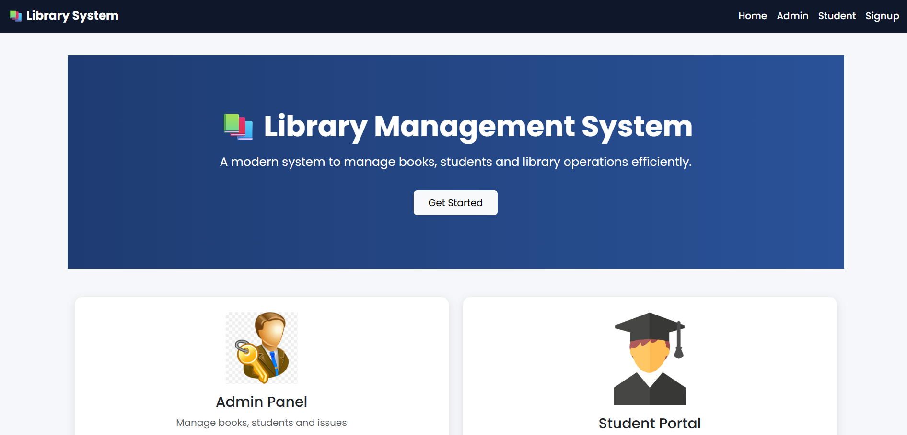

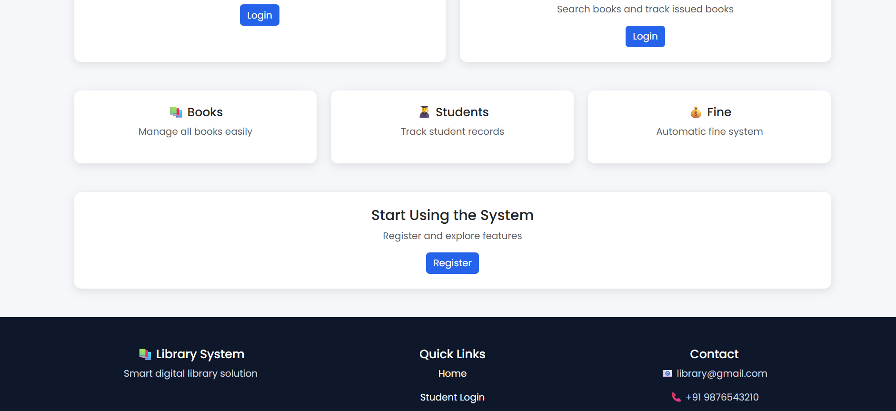

### Admin Login

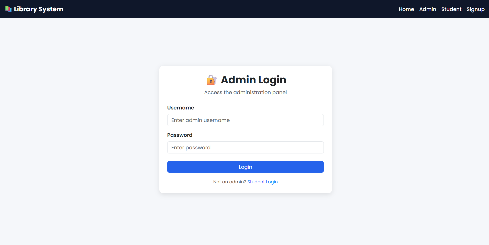

### Admin Students Management

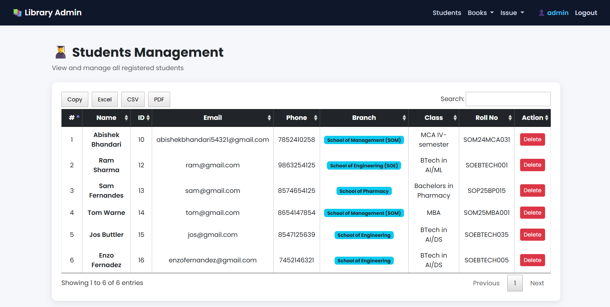

### Admin Issue Book

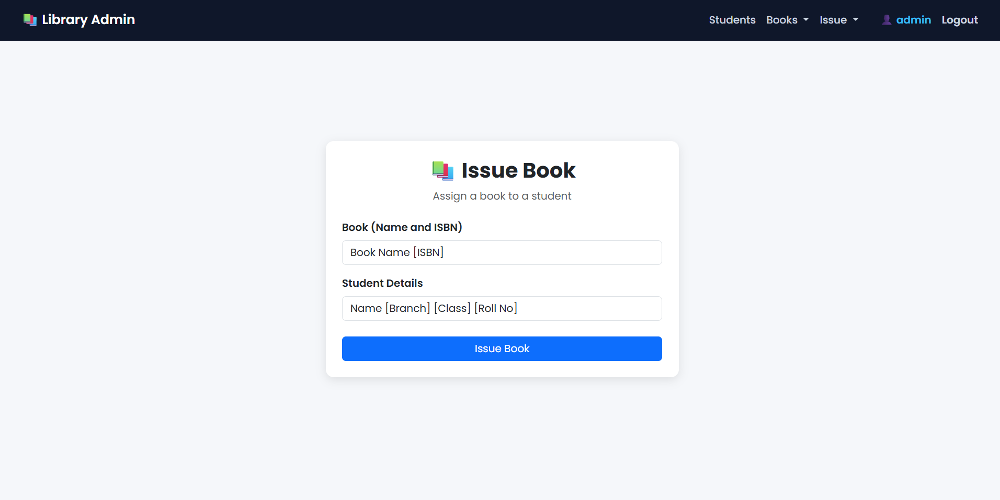

### Admin Issued Books Dashboard

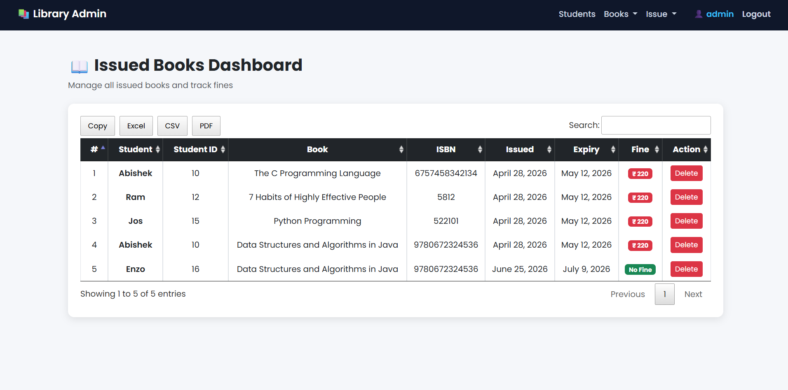

### Admin Book Management

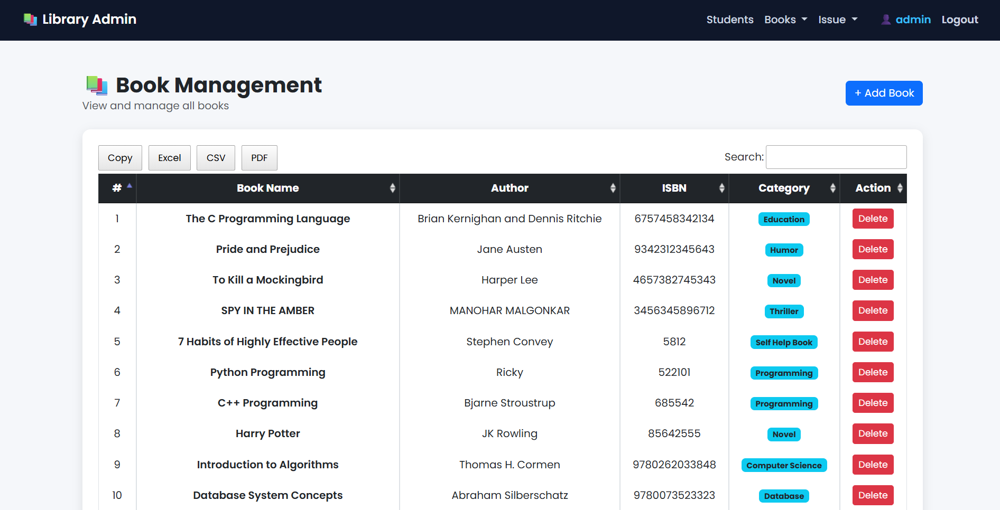

### Admin Add Book

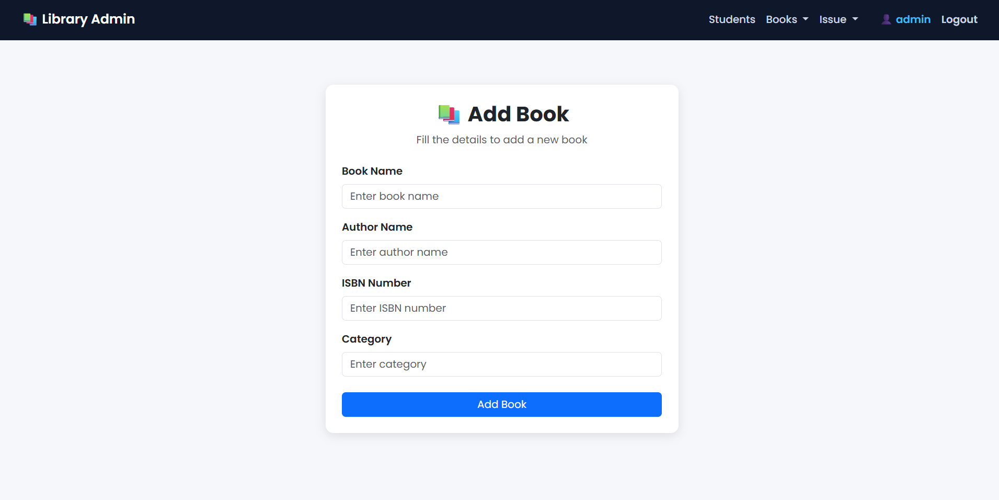

### Student Registration

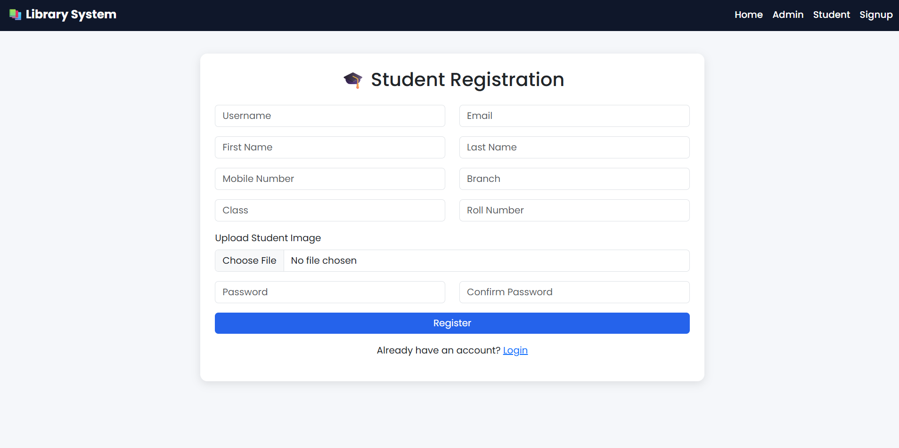

### Student Login

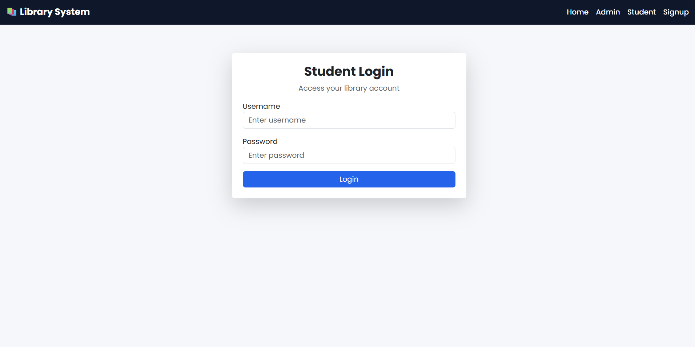

### Student Profile

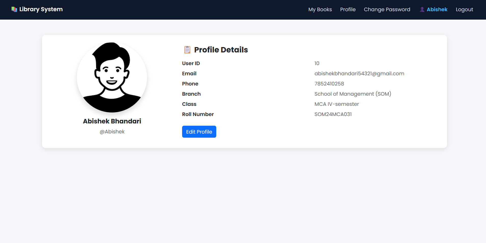

### Student Issued Books

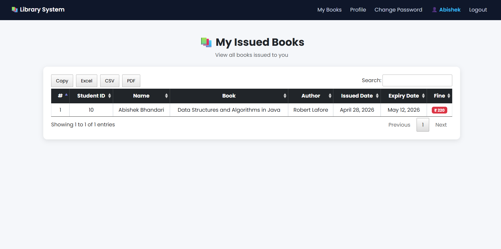

### Student Change Password

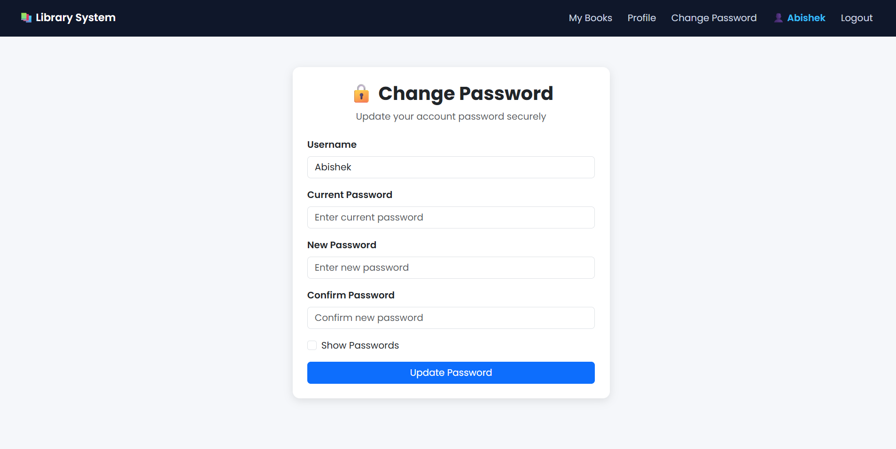

## 🎯 Learning Outcomes

This project helped me learn:

- Django Framework
- CRUD Operations
- Authentication System
- Database Management
- Template Inheritance
- Frontend Integration
- Git & GitHub Workflow

---

## 👨‍💻 Author

Abishek Bhandari

GitHub: https://github.com/abishekbhandari54321

---
